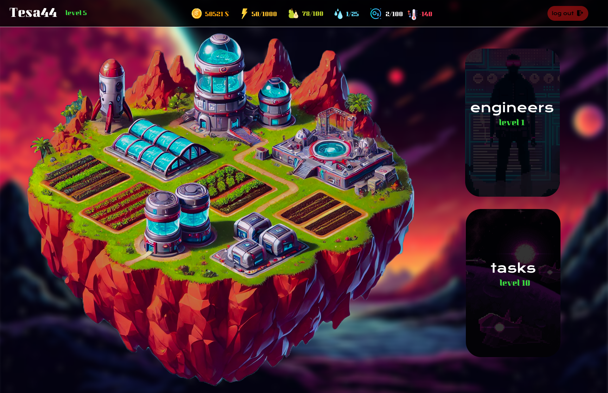

# [marsColonization](https://marscolonization.vercel.app)

# nasza gra dostepna tutaj -> [marsColonization](https://marscolonization.vercel.app)
(moga wystapic problemy przy pierwszym wejsciu na strone, wynika to z faktu, iz nasz darmowy serwer musi sie uruchomic, aby obsluzyc requesty, zazwyczaj zajmuje to od 10s do 30s, przy starcie aplikacji)

- [plan](#plan)
- [baza danych](#baza-danych)
- [proces](#proces)
    - [deployment](#deployment)
    - [frontend](#frontend)
        - [jak uruchomic front](#jak-uruchomic-front)
        - [architektura](#architektura)
    - [backend](#backend)
        - [jak uruchomic back](#jak-uruchomic-back)

design by [xmavv](https://github.com/xmavv)

# plan

Profesje:
- elektryk
- biolog
- hydrolog
- chemik
- meteorolog

Zasoby:
- woda
- jedzenie
- tlen
- energia
-monety
-temperatura

Budynki:
- laboratorium - do produkcji tlenu
-hydropolis - do produkcji wody
- farma hydroponiczna - do produkcji jedzenia
- elektrownia - do produkcji energii
- budynek specjalny do ustabilizowania temperatury na Marsie (central)

Zadania do terraformacji (Taski):
- badanie próbek gleby
- zwiad
- pozyskiwanie minerałów
- budowa stacji produkcji tlenu
- zwiększanie ciśnienia atmosferycznego
- ocieplanie planety
- wprowadzanie roślinności

Mechanika:
- Workersi mogą produkować każdy rodzaj zasobów w budynkach
- Przebieg gry: wskaźnik tlenu i temperatury na planecie. Gracz musi doprowadzić do określonej wartości tych dwóch czynników, aby skolonizować Marsa
- Do temperatury i tlenu będą specjalne budynki, które można ulepszać, aby zwiększyć wydajność. Ulepszenie tych budynków wiąże się ze zwiększonym zużyciem energii oraz większą ilością kolonistów.
- Energia: można ją zdobywać poprzez rozbudowę farmy paneli słonecznych. Po ulepszeniu farma wymaga większej ilości kolonistów do jej obsługi
- Jedzenie: można je zdobywać na farmach hydroponicznych. Po ulepszeniu farma wymaga większej ilości kolonistów do jej obsługi oraz większej ilości wody i tlenu.
- Tlen: można go zdobywać w specjalnym budynku. Po ulepszeniu potrzeba większej ilości kolonistów i większej ilości energii.
- Przebieg gry: wskaźnik tlenu i temperatury na planecie. Gracz musi doprowadzić do określonej wartości tych dwóch czynników, aby skolonizować Marsa
- Po kolonizacji można dalej wykonywać taski i upgradować swoje imperium
- Taski: Workersi mogą być wysyłani na ekspedycje w celu pozyskania dodatkowych surowców takich jak woda, jedzenie itd. Za taski otrzymujemy dany surowiec (typ taska), coinsy. Zeby odpalic taska musimy miec rowniez okreslona ilosc energii. Taski trwają określony czas generujemy, generujemy taski raz i trzymamy je w statycznej tabeli, wykorzystując indexy w tablicy, taski będą różnego poziomu z różnymi celami, tak aby gracz na każdym poziomie mógł wybrać odpowiednie. Taski będą również dodawać monety do naszego konta.

# baza danych

# proces

## deployment

- baza danych jest hostowana w serwisie [aiven.io](https://aiven.io/)
- serwer express do api jest hostowany w serwisie [render.com](https://render.com/)
- aplikacja front jest hostowana w serwisie [vercel.com](https://vercel.com)

## frontend

### jak uruchomic front

- node.js musi byc zainstalowany
- wchodzimy bezposrednio do folderu `./FRONTEND`
- instalujemy paczki `npm i`
- uruchamiamy aplikacje `npm run dev` (prosze zwrocic uwage na branche!)
- w przegladarce wchodzimy na adres `http://localhost:5173/`

### architektura 

## backend

### jak uruchomic back

- node.js musi byc zainstalowany do pobrania paczek
- wchodzimy bezpośrednio do folderu `./BACKEND`
- instalujemy paczki `npm i`
- tworzymy plik `config.env` w `./src` i ustawiamy `HOST=127.0.0.1`, `USER=root`, `PASSWORD=(twoje haslo do twojej lokalnej instancji mysql)`,  `PORT=8000`, `DATABASE=mars_colonization`.
- wymagane jest lokalne utworzenie bazy danych póki co, więc będąc w `./BACKEND` w terminalu wpisujemy `mysql -u root -p` i się logujemy do lokalnego mysql. Następnie tworzymy lokalną bazę `source schema.sql`.
- teraz można uruchomić aplikację `npm run start:dev`
- api można testować w przeglądarce, ale polecam aplikację `POSTMAN`.
